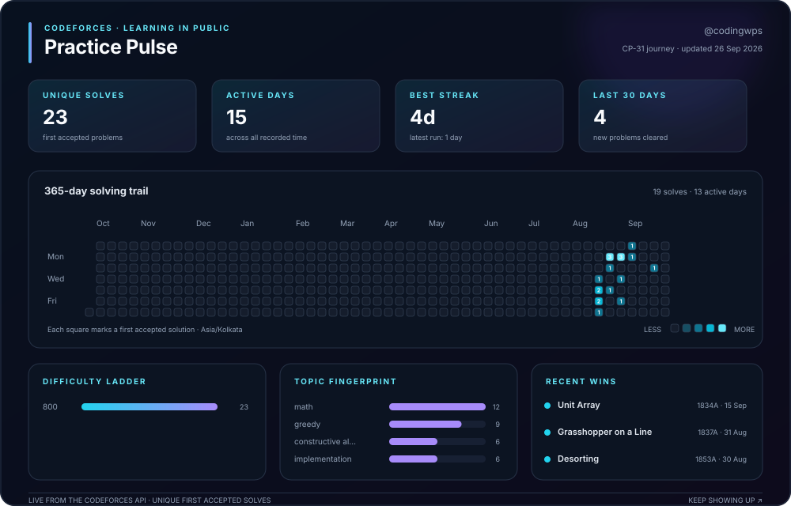

# Data Structure Practice

My growing collection of Codeforces solutions while learning competitive programming with the TLE Eliminators CP-31 Sheet.

## About

I am learning to write better code by solving Codeforces problems consistently. Solutions are organised by problem rating, with a short description, pattern, and sample test included in each file for quick revision.

- **Codeforces:** [codingwps](https://codeforces.com/profile/codingwps)
- **Practice sheet:** [TLE Eliminators CP-31](https://www.tle-eliminators.com/cp-sheet)

## Pattern Map

Problems are grouped by their main reusable idea to keep this revision list compact. **Bold problems** are on my solve-again list.

| Pattern family | Problems |
|---|---|
| Greedy & gaps | **[Line Trip](https://codeforces.com/problemset/problem/1901/A)** ([code](800-level/line%20trip.py)), [Halloumi Boxes](https://codeforces.com/problemset/problem/1903/A) ([code](800-level/halloumi%20boxes.py)), [Cover in Water](https://codeforces.com/problemset/problem/1900/A) ([code](800-level/cover%20in%20water.py)) |
| Strings | [Helpful Maths](https://codeforces.com/problemset/problem/339/A) ([code](800-level/helpful%20maths.py)), [Way Too Long Words](https://codeforces.com/problemset/problem/71/A) ([code](800-level/way%20too%20long.py)), [Don't Try to Count](https://codeforces.com/problemset/problem/1881/A) ([code](800-level/don%27t%20try%20to%20count.py)) |
| Invariants & ordering | [Jagged Swaps](https://codeforces.com/problemset/problem/1896/A) ([code](800-level/jagged%20swaps.py)) |
| Games & modular math | [Game with Integers](https://codeforces.com/problemset/problem/1899/A) ([code](800-level/game%20with%20integer.py)) |
| Frequency & constructive | **[Doremy's Paint 3](https://codeforces.com/problemset/problem/1890/A)** ([code](800-level/doremys%20paint%203.py)) |
| Membership check | **[How Much Does Daytona Cost?](https://codeforces.com/problemset/problem/1878/A)** ([code](800-level/how%20much%20does%20daytona%20cost.py)) |

## Practice pulse

This dashboard refreshes automatically from my public Codeforces submissions. It tracks unique first accepted solves, consistency, difficulty, topic patterns, and recent progress.

---

Feel free to connect with me if you think we can learn together and practice questions. I would love to build a small practice group.

