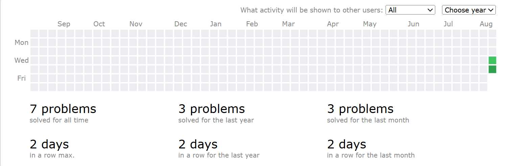

# Data Structure Practice

I am learning to write code on Codeforces and practising competitive programming with the [TLE Eliminators CP-31 Sheet](https://www.tle-eliminators.com/cp-sheet).

[](https://www.python.org/)
[](https://codeforces.com/profile/codingwps)
[](https://www.tle-eliminators.com/cp-sheet)

## Solved problems

| Rating | Problem | Pattern | Solution |
|:---:|---|---|---|
| 800 | [1903A — Halloumi Boxes](https://codeforces.com/problemset/problem/1903/A) | Greedy, sorting | [Python](800-level/halloumi%20boxes.py) |
| 800 | [339A — Helpful Maths](https://codeforces.com/problemset/problem/339/A) | Sorting, strings | [Python](800-level/helpful%20maths.py) |
| 800 | [1901A — Line Trip](https://codeforces.com/problemset/problem/1901/A) | Greedy, gaps | [Python](800-level/line%20trip.py) |
| 800 | [71A — Way Too Long Words](https://codeforces.com/problemset/problem/71/A) | Strings, implementation | [Python](800-level/way%20too%20long.py) |

More rating folders will be added as I progress through the sheet.

## Codeforces activity

[](https://codeforces.com/profile/codingwps)

[](https://codeforces.com/profile/codingwps)

The heatmap above is a snapshot of my Codeforces activity. Visit my [Codeforces profile](https://codeforces.com/profile/codingwps) for the latest submissions.

## Repository structure

```text
data-structure-practice/
├── 800-level/
│   ├── halloumi boxes.py
│   ├── helpful maths.py
│   ├── line trip.py
│   └── way too long.py
├── assets/
│   └── codeforces-contributions.png
└── README.md
```

Each solution keeps the original executable code and adds only a brief documentation comment at the top.
